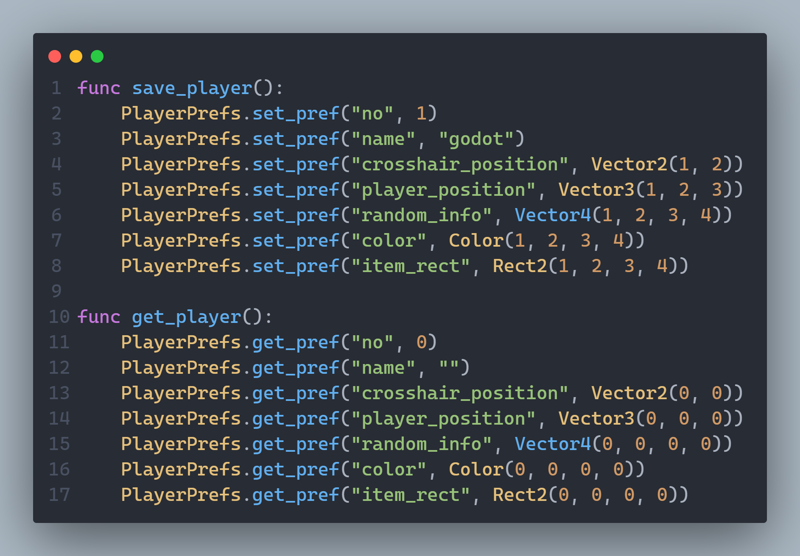
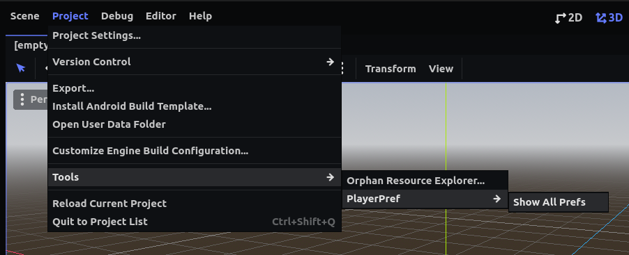

# PlayerPrefs

<!-- centre image  -->
<p align="center">
  
</p>

## Description

This is a simple class that allows you to save and load data in a file. It is very easy to use and it is very useful for saving game data.



## How to use

### Save data
```gdscript

# Save individual data
func save_player():
	PlayerPrefs.set_pref("no", 1)
	PlayerPrefs.set_pref("name", "godot")
	PlayerPrefs.set_pref("crosshair_position", Vector2(1, 2))
	PlayerPrefs.set_pref("player_position", Vector3(1, 2, 3))
	PlayerPrefs.set_pref("random_info", Vector4(1, 2, 3, 4))
	PlayerPrefs.set_pref("color", Color(1, 2, 3, 4))
	PlayerPrefs.set_pref("item_rect", Rect2(1, 2, 3, 4))

# Save complete information
func set_player_base():
	var player = {"no": 1, 
		"score": 0,
		"crosshair_position": Vector2(1, 2),
		"player_position": Vector3(1, 2, 3),
		"random_info": Vector4(1, 2, 3, 4),
		"color": Color(1, 2, 3, 4),
		"item_rect": Rect2(1, 2, 3, 4)}
	
	PlayerPrefs.set_base(player)
```


### Signal for save data
When ever preferences are changed, it will emit a signal. To listen to the signal, use the following code.

```gdscript
PlayerPrefs.prefs_changed.connect(_on_prefs_changed)

func _on_prefs_changed(key, value):
	print("Prefs changed:- ", key, " : ", value)

```


### Load data
```gdscript

# Load individual data
func get_player():
	PlayerPrefs.get_pref("no", 0)
	PlayerPrefs.get_pref("name", "")
	PlayerPrefs.get_pref("crosshair_position", Vector2(0, 0))
	PlayerPrefs.get_pref("player_position", Vector3(0, 0, 0))
	PlayerPrefs.get_pref("random_info", Vector4(0, 0, 0, 0))
	PlayerPrefs.get_pref("color", Color(0, 0, 0, 0))
	PlayerPrefs.get_pref("item_rect", Rect2(0, 0, 0, 0))

# Load complete information

func get_player_base():
	PlayerPrefs.get_base()
```

### Check Data
Use Editor option to check saved preferences.


It will print the data in the console.

